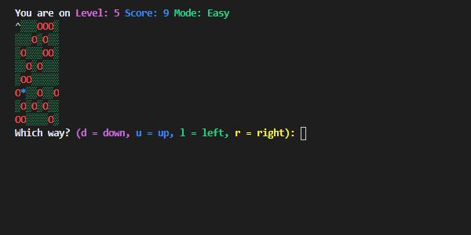
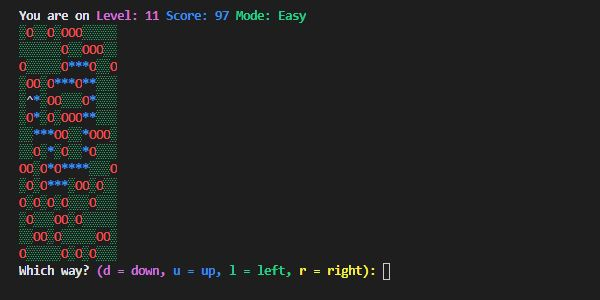

# Find Your Hat

Find Your Hat is one of Codecademy's open-ended projects, in which it is encouraged to problem solve and utilize other resources, instead of being provided with step-by-step guidance. The requirements were to build an interactive terminal game with the scenario that the player has lost their hat in a field full of holes, and must navigate back to it without falling down one of the holes or stepping outside of the field. The project setup is centered on a Field class, and we were given tasks which described how the class should function at a high level. We then needed to figure out how to the implement each task in code and test our code by creating instances of the class and calling its methods.

Requirements:

1. The Field constructor should take a two-dimensional array argument representing the “field” itself.
2. Give the Field class a .print() method that prints the current state of the field.
3. The game should be playable by users, and they should be prompted for their next move until:
    - The player wins by finding their hat.
    - The player loses by landing on (and falling in) a hole.
    - The play attempts to move “outside” the field.
4. Give the Field class a static .generateField() method that takes arguments for height and width of the field, and returns a randomized two-dimensional array representing the field with a hat and one or more holes.

Project Extensions:

Additionally, I chose to implement a few project extensions which are as follows:

1. Introduce levels and a scoreboard into the game, in which the height and width of the field increases each level.
2. Have the character start on a random location that’s not the upper-left corner.
3. Create a “hard mode” where one or more holes are added after certain turns.
4. Improve the game’s graphics utilizing a terminal package.
5. Create a field validator to ensure that the field generated by Field.generateField() can actually be played and solved.

## Table of Contents

- [Technologies](#technologies)
- [Screenshots](#screenshots)
- [Status](#status)

## Technologies

This project was created with:

- JavaScript ES6
- Node.js version: 14.15.1
- Prompt-sync version: 4.2.0
- Terminal Kit version: 1.45.9

## Screenshots

## Status

This project has been completed.